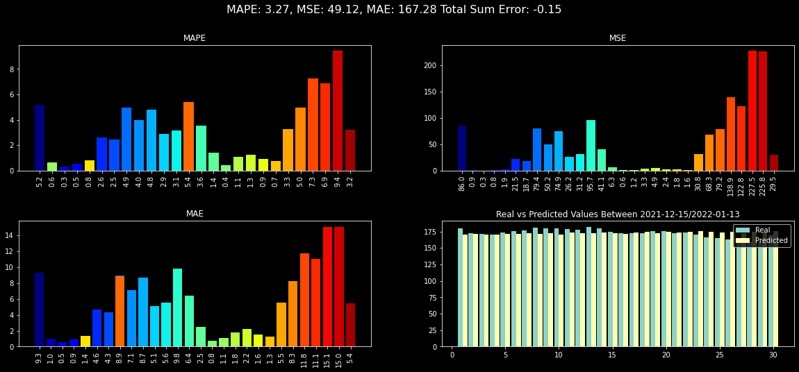

# Easy Stock Predictor by Altemur Celikayar


```python
from Stock_Predict_by_Altemur import Stock_Predictor as sp
```

### TSLA Stock Test


```python
stock = sp(stock_name = 'TSLA',
           start_date = '2013-01-01',
           end_date = '2022-01-22',
           day_to_forecast = 7,
           tester_mode = True)
```


```python
_, test = stock.stock_data()    
true = test.y.values
```


```python
test
```


<div>
<style scoped>
    .dataframe tbody tr th:only-of-type {
        vertical-align: middle;
    }

    .dataframe tbody tr th {
        vertical-align: top;
    }

    .dataframe thead th {
        text-align: right;
    }
</style>
<table border="1" class="dataframe">
  <thead>
    <tr style="text-align: right;">
      <th></th>
      <th>ds</th>
      <th>y</th>
    </tr>
    <tr>
      <th>Date</th>
      <th></th>
      <th></th>
    </tr>
  </thead>
  <tbody>
    <tr>
      <th>2022-01-12</th>
      <td>2022-01-12</td>
      <td>1106.219971</td>
    </tr>
    <tr>
      <th>2022-01-13</th>
      <td>2022-01-13</td>
      <td>1031.560059</td>
    </tr>
    <tr>
      <th>2022-01-14</th>
      <td>2022-01-14</td>
      <td>1049.609985</td>
    </tr>
    <tr>
      <th>2022-01-18</th>
      <td>2022-01-18</td>
      <td>1030.510010</td>
    </tr>
    <tr>
      <th>2022-01-19</th>
      <td>2022-01-19</td>
      <td>995.650024</td>
    </tr>
    <tr>
      <th>2022-01-20</th>
      <td>2022-01-20</td>
      <td>996.270020</td>
    </tr>
    <tr>
      <th>2022-01-21</th>
      <td>2022-01-21</td>
      <td>943.900024</td>
    </tr>
  </tbody>
</table>
</div>


```python
pred, df_datetime = stock.prediction(epochs = 100)
```


```python
sp.plot_2d(stock, pred, df_datetime, true)
```


    

    


```python
sp.plot_error(pred, df_datetime, true)
```


    

    


### TSLA Future Forecast


```python
stock = sp(stock_name = 'TSLA',
           start_date = '2013-01-01',
           end_date = '2022-01-22',
           day_to_forecast = 7,
           tester_mode = False)
```


```python
pred, df_datetime = stock.prediction(epochs = 10)
```

    INFO - (NP.forecaster._handle_missing_data) - 1026 missing dates added.
    INFO - (NP.forecaster._handle_missing_data) - 1026 NaN values in column y were auto-imputed.
    Epoch[10/10]: 100%|██████████| 10/10 [00:02<00:00,  3.95it/s, SmoothL1Loss=0.000534, MAE=9.59, RMSE=20.7, RegLoss=0]
    WARNING - (NP.forecaster.predict) - raw forecasts are incompatible with plotting utilities
    INFO - (NP.forecaster._handle_missing_data) - 3 missing dates added.
    INFO - (NP.forecaster._handle_missing_data) - 3 NaN values in column y were auto-imputed.


```python
sp.plot_2d(stock, pred, df_datetime)
```


    

    


# Easy Mode Forecasting Future Demo AAPL


```python
sp.easy_mode('AAPL', 30)
```

    INFO - (NP.forecaster._handle_missing_data) - 1029 missing dates added.
    INFO - (NP.forecaster._handle_missing_data) - 1029 NaN values in column y were auto-imputed.
    Epoch[200/200]: 100%|██████████| 200/200 [00:55<00:00,  3.62it/s, SmoothL1Loss=0.000345, MAE=2.01, RMSE=3.23, RegLoss=0]
    WARNING - (NP.forecaster.predict) - raw forecasts are incompatible with plotting utilities
    INFO - (NP.forecaster._handle_missing_data) - 3 missing dates added.
    INFO - (NP.forecaster._handle_missing_data) - 3 NaN values in column y were auto-imputed.


    

    


    array([169.98906, 169.87022, 169.26875, 169.90964, 169.87775, 170.14636,
           172.20674, 170.17596, 169.52185, 170.82947, 172.85593, 171.1863,
           172.26283, 170.6773, 171.20253, 171.46211, 173.12227, 172.20535,
           172.03386, 174.21162, 170.9916, 174.03862, 173.71982, 173.67345,
           173.72755, 173.94266, 174.89307, 174.77953, 173.56415, 173.14565],
          dtype=object)


## Easy Mode Forecasting Model Test Demo AAPL


```python
sp.easy_mode_model_test('AAPL', 30)
```

    INFO - (NP.forecaster._handle_missing_data) - 1014 missing dates added.
    INFO - (NP.forecaster._handle_missing_data) - 1014 NaN values in column y were auto-imputed.
    Epoch[200/200]: 100%|██████████| 200/200 [00:56<00:00,  3.54it/s, SmoothL1Loss=0.000345, MAE=1.93, RMSE=3.14, RegLoss=0]
    WARNING - (NP.forecaster.predict) - raw forecasts are incompatible with plotting utilities
    INFO - (NP.forecaster._handle_missing_data) - 2 missing dates added.
    INFO - (NP.forecaster._handle_missing_data) - 2 NaN values in column y were auto-imputed.


    

    


    

    


    array([170.02805, 171.29129, 170.59137, 170.64854, 171.60143, 171.00525,
           171.95805, 171.41853, 172.20143, 170.72762, 173.08617, 171.98518,
           172.22704, 173.29192, 172.4126, 171.24736, 173.26624, 174.01816,
           172.8688, 173.96848, 173.54362, 174.35011, 175.34552, 174.49498,
           173.41014, 174.1974, 172.70201, 174.86162, 174.71788, 175.75906],
          dtype=object)


